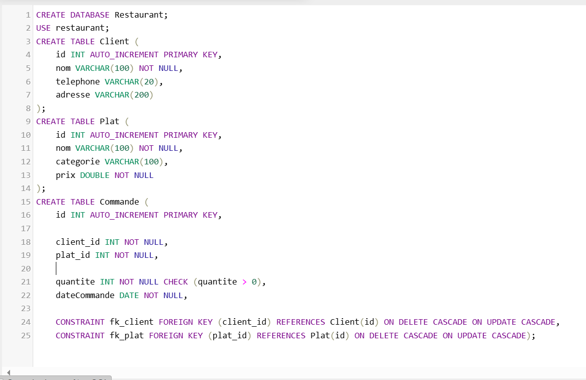

"# Project_GestionRestaurant.java" 
# 🍽️ Application de Gestion d’un Restaurant

## 🎯 Objectif du projet
Ce projet consiste à développer une application Java permettant de gérer les **clients**, **plats** et **commandes** d’un restaurant.  
L’application inclut également des outils d’analyse : **calcul des recettes**, **filtrage**, et **statistiques** sur les plats les plus vendus.

---

## 🚀 Fonctionnalités du projet

### ✔ Gestion des Clients
- Ajouter / Modifier / Supprimer un client  
- Attributs : nom, téléphone, adresse

### ✔ Gestion des Plats
- CRUD sur les plats  
- Filtrage par **catégorie**  
- Attributs : nom, catégorie, prix

### ✔ Gestion des Commandes
- Créer une commande  
- Associer un client + un plat  
- Définir quantité + date  
- Calcul automatique du total d'une commande

### ✔ Statistiques & Analyse
- Calcul du **chiffre d’affaires**  
- Chiffre d’affaires **par plat**   
- Graphique : ** Chiffre d’affaires par plat**
---

## Creation de la base de donnes :

## 🗄️ Modèle Conceptuel de Données (MCD)

### ✔ Entité : Client
- idClient  
- nom  
- telephone  
- adresse  

### ✔ Entité : Plat
- idPlat  
- nom  
- categorie  
- prix  

### ✔ Entité : Commande
- idCommande  
- quantite  
- dateCommande  

### ✔ Associations
- **PASSER** → Client (1,N) — Commande (1,1)  
- **CONTENIR** → Plat (1,N) — Commande (1,1)

---

## 🛠 Technologies Utilisées

- **💻 Java Swing : Utilisé pour développer l'interface graphique de l'application. Permet de créer une interface conviviale et réactive.**
- **📊 MySQL : Base de données relationnelle utilisée pour stocker les informations sur les bus, les étudiants et les abonnements.** (Formulaires : Form.java)
- **🔗 JDBC : Utilisé pour connecter l'application Java à la base de données MySQL et gérer les opérations de lecture et d'écriture.** (Connexion.java)
- **🛠 NetBeans : IDE de développement utilisé pour écrire, déboguer et exécuter le code Java du projet.**
- **🗂 phpMyAdmin : Outil de gestion de la base de données MySQL via une interface web. Utilisé pour configurer et maintenir la base de données.**

---
## 💻 Démonstration dans NetBeans

🎥 [Voir la vidéo NetBeans : ](https://drive.google.com/file/d/1wBUq47DakoQu4_pMnpkVdhD60prPZ5iu/view?usp=drive_link)

## 💻 Installation et Execution

🎥 [Voir la vidéo : ](https://drive.google.com/file/d/1JslVJoHGSYj-fSKZVpVNCjRLHDXcd3_T/view?usp=drive_link)

---

## 🖊️ Auteur

**Nom :** NOUHAYLA SABIQ 
**Cours :** java  
**Date :** 2 Décembre 2025  
**Encadré par :** Pr. Mohamed LACHGAR
